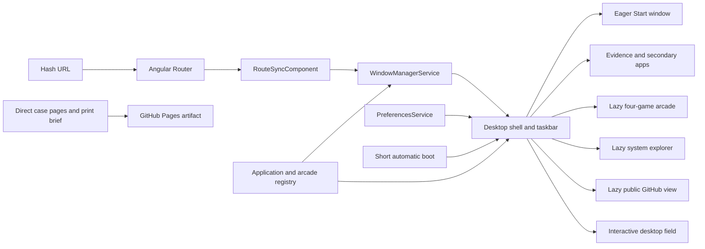
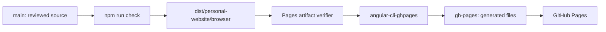

# PatterOS Architecture

## Product contract

PatterOS is a static personal portfolio built as a small, original desktop. The shell is playful, but the work stays clear and quick to reach. Games, an interactive background, layout controls, and visual preferences deepen the visit without standing between a reader and the résumé.

The product direction takes one lesson from standout personal sites: the medium should demonstrate the maker's craft. In PatterOS, working window mechanics, responsive behavior, a reactive desktop field, and small games carry that demonstration. The first view stays concise and detailed evidence opens on demand. This is an interaction principle, not a license to copy another site's visual style; the components, type, icons, motion, and copy remain original to PatterOS.

The launch architecture optimizes for five properties:

1. **Clear first view:** name, role, selected impact, résumé, and contact are quickly reachable after a roughly one second automatic boot.
2. **Static reliability:** the complete site runs from files on GitHub Pages with no application server.
3. **Accessible adaptation:** wide screens support movable windows; compact and reading modes preserve normal document flow and focus order.
4. **Useful customization:** color, motion, texture, reading layout, window size, and window position are local preferences with safe defaults.
5. **Controlled novelty:** eight purposeful desktop shortcuts in a compact cluster, one coherent PatterOS visual language, locally shipped resources, short motion, and no borrowed operating system skin.

## System overview



The registry defines the finite set of applications, desktop shortcut visibility, custom icon names, window defaults, and arcade game metadata. The window manager owns open, minimize, maximize, focus, depth, position, and size state. The router translates a shareable hash route into an application open request. Preferences apply theme and comfort choices without becoming portfolio data.

## Application layers

### Bootstrap and routing

`src/main.ts` bootstraps a standalone Angular application. `app.config.ts` configures the router with `withHashLocation()` and component input binding.

Hash routing is an infrastructure decision, not an aesthetic one. GitHub Pages cannot rewrite an unknown path to `index.html`. A URL such as `/#/builds` always asks the static host for `/`, which exists and returns `200`; Angular reads the fragment after startup.

The production build must set:

```text
base href = /
```

Do not add a copied `404.html` SPA fallback while hash routing is active.

### Boot and first paint

The root document contains a small fallback, then Angular shows a short PatterOS boot card while the shell mounts. It lasts about 1.1 seconds with motion enabled and about 80 milliseconds for a reduced motion preference. The boot is a noninteractive status view and closes automatically.

The boot sequence has no network or data dependency. It stages the desktop icons and Start window rather than hiding a slow application startup. The résumé and contact fallback in `index.html` remain available when JavaScript is disabled.

### Registry

`src/app/core/app.registry.ts` is the source of truth for application identity, labels, routes, initial geometry, desktop shortcut visibility, custom icon names, and arcade game summaries.

Adding an application should begin with its typed registry definition. Consumers derive shortcuts, taskbar entries, routes, and window state from that shared identity rather than maintaining parallel string lists.

All eight applications receive desktop shortcuts in a compact cluster. The launcher, taskbar, routes, and contextual links reuse the same typed registry. Fresh default window positions begin beyond the icon cluster so discovery does not create overlap.

### Window state

`WindowManagerService` keeps workspace state in Angular signals. A pure reducer enforces transitions, while the service exposes computed views and narrow commands such as `open`, `close`, `restore`, `focus`, `toggleMaximize`, `move`, and `resize`.

Constraints:

- Content components do not mutate depth, coordinates, or dimensions directly.
- Pointer resize and keyboard resize use the same bounded reducer action.
- The title bar exposes familiar minimize, maximize or restore, and close buttons.
- A compact options menu contains Cozy, Default, Wide, and Fit Screen size choices, link copying, and keyboard accessible repositioning without crowding the primary window chrome.
- Compact layouts disable free dragging and show the active window; the taskbar switches between
  other open windows. Comfortable Reading presents every open window in document order.
- Essential content must remain usable if drag interaction is unavailable.
- Position and size are stored under the versioned `patteros.window-layout.v3` key. Open, minimized, maximized, focus, and depth state stay transient.
- Viewport fitting is derived for display and never overwrites the saved preferred geometry.

### Preferences

`PreferencesService` owns Day Shift, Night Shift, High Contrast, scanline visibility, motion, and Comfortable Reading. Values are stored under a versioned local storage key. Storage failures are nonfatal.

The operating system reduced motion preference wins on initial load. The UI does not reenable animation against that preference without an explicit user action. Comfortable Reading stacks open windows, disables drag-only controls, and increases text spacing without introducing a second content model.

### Portfolio applications

Start Here, Work Log, and Builds are the primary portfolio applications. About Connor, Résumé, and Say Hello are secondary destinations available from the launcher and contextual links. They are semantic Angular content inside the shell, not images of text or terminal role play. Start Here stays in the initial bundle. Heavier evidence windows use Angular deferred boundaries and load when opened.

The first view favors short summaries and clear actions. Detailed architecture, decisions, tradeoffs, and résumé evidence remain available in their own windows and direct pages instead of appearing as a wall of copy on startup.

Every case study follows the same evidence chain:

```text
constraint → decision → implementation → measured result → tradeoff
```

Employer-sensitive implementation details remain generalized. Published numbers must be supportable by the résumé or a source Connor explicitly approved for portfolio use.

Work Log includes accessible, sanitized architecture flows and direct links to static case pages. Builds includes decision logs and lazy project diagrams with explicit provenance. Résumé links both the source PDF and a print-friendly evidence brief.

### Arcade boundary

The entire Arcade application is a dynamic import and stays outside the initial portfolio bundle. Snake, Memory Match, Tic Tac Toe, and Minesweeper use native DOM controls and deterministic TypeScript state, which keeps the games accessible and inexpensive to run.

Snake supports WASD and visible direction buttons. Memory Match, Tic Tac Toe, and Minesweeper use standard buttons. The games work with touch and provide restart behavior where the game state needs it. Visibility changes pause active play, teardown clears timers, and no game starts audio.

### Direct pages and print output

Two production stories also ship as plain static HTML under `public/case-studies/`. They have independent canonical URLs, responsive and print styles, local fonts, and links back into the matching hash route. `public/evidence-brief.html` is a compact interview handout that prints cleanly or saves as a PDF. These pages remain useful without the Angular runtime and make specific evidence easy to share.

## Dependency rationale

| Dependency          | Architectural role                                            | Boundary                                                                       |
| ------------------- | ------------------------------------------------------------- | ------------------------------------------------------------------------------ |
| Angular 22          | Standalone application, router, signals, dependency injection | Application framework only; avoid wrappers for simple platform APIs            |
| Angular CDK         | Drag interaction primitives                                   | Window mechanics only; resize and size presets remain native platform controls |
| RxJS                | Angular ecosystem runtime                                     | No application event bus or store                                              |
| Fontsource          | Local Space Grotesk and Azeret Mono files                     | Mixed case brand type and readable body type with no runtime font request      |
| angular-cli-ghpages | Local publication of compiled files                           | Development dependency; publishes the generated `gh-pages` branch              |
| Vitest              | Pure state, persistence, and rules tests                      | Workspace reducer, registry, preferences, and both game engines                |
| Playwright and axe  | Browser, viewport, focus, and accessibility checks            | App modes, arcade, and static pages from 320 through 1440 pixels               |
| ESLint and Prettier | Static correctness and formatting                             | Deterministic local gate                                                       |

Versions are exact in `package.json`, resolved by `package-lock.json`, and updated deliberately. A new dependency needs a clear boundary, an acceptable license, active maintenance, and a measurable benefit that cannot be achieved cleanly with the platform or current stack.

## Static asset and network policy

Everything required to render and navigate the site is part of the deployed artifact:

- résumé PDF
- SVG favicon
- web app manifest
- `robots.txt` and `sitemap.xml`
- PNG social preview
- direct case pages and shared case page styles
- print evidence brief and project evidence diagrams
- application JavaScript and CSS
- fonts and game assets

External links to GitHub, LinkedIn, email, and project destinations are content. External runtime scripts and styles are prohibited. There is no launch-time backend, analytics SDK, ad network, or remote font host.

## Build artifact contract

The deployable directory is:

```text
dist/personal-website/browser
```

`scripts/verify-pages.mjs` runs after the Pages production build and enforces:

- one exact `<base href="/">`
- presence of the résumé, favicon, manifest, robots, sitemap, PNG social card, evidence diagrams, print brief, and direct case pages
- correct manifest scope/start URL and primary metadata references
- correct canonical URLs and a single main heading on each direct page
- valid local references from generated HTML and CSS
- no external runtime script or stylesheet references
- no generated `404.html` while hash routing is the contract

This verifies the artifact that will be published, not merely the source configuration that intended to produce it.

## Publishing architecture



| Branch     | Ownership                        | Allowed content                                      |
| ---------- | -------------------------------- | ---------------------------------------------------- |
| `main`     | Reviewed source of truth         | Source, tests, documentation, locked dependencies    |
| `gh-pages` | Generated by the local publisher | The verified static browser artifact and `.nojekyll` |

The repository uses **Deploy from a branch**, `gh-pages`, `/(root)`. It does not own a custom GitHub Actions workflow. GitHub may display its internal Pages deployment run; that is platform behavior rather than a repository workflow.

Publishing is manual so the same workstation that validates the source publishes the exact checked artifact. A deploy should only run from a clean, reviewed `main` commit.

## Quality strategy

The authoritative local gate is `npm run check`:

1. Prettier verification
2. ESLint
3. unit/browser tests
4. optimized Pages build
5. built-artifact verification
6. seven viewport app smoke gate plus direct page, print, and axe checks
7. production dependency audit

Automated checks are necessary but not sufficient for visual acceptance. Before publishing a material UI change, inspect wide desktop, compact and mobile layouts, keyboard use, every color mode, Comfortable Reading, and reduced motion. Confirm the automatic boot completes quickly, focus never becomes trapped, resizing stays bounded, shared routes survive reload, the background never blocks controls, and every game can restart cleanly.

## Extension rules

### Add a desktop application

1. Add a typed definition to the registry.
2. Implement semantic content with a useful compact layout.
3. Connect rendering through the shell's application host and choose an eager or deferred boundary deliberately.
4. Add route, keyboard, focus, sharing, and responsive tests.
5. Confirm the initial bundle and visual density stay within budget.

### Add an arcade game

1. Add game metadata to the registry.
2. Put implementation behind a dynamic import.
3. Define mount, visibility pause, and teardown behavior.
4. Support the controls appropriate to the game, including keyboard and touch, plus restart and reduced motion.
5. Test completion, loss where applicable, restart, resize, and repeated mount cases.

### Add a local utility

1. Give it a real visitor task rather than adding decorative operating system furniture.
2. Keep network access out of the default design and version any persisted local data.
3. Handle unavailable, malformed, and quota limited storage without blocking the application.
4. Use browser platform APIs for explicit actions such as copy or download.
5. Test keyboard use, compact layouts, persistence boundaries, and destructive action safeguards.

### Add a networked feature

Treat this as an architecture change. Document data collection, retention, abuse controls, availability, cost ceiling, degraded behavior, and secret management before implementation. The static portfolio must continue to work if that service is unavailable.
